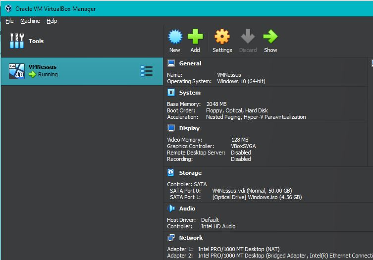
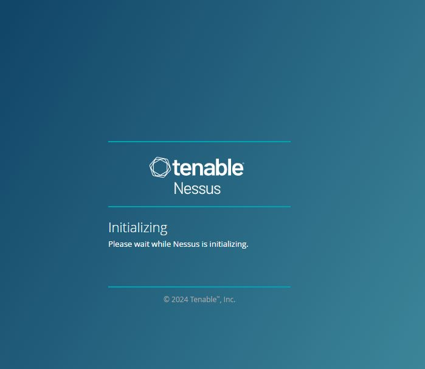
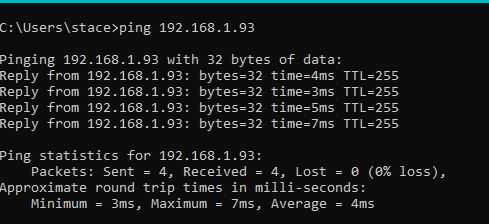
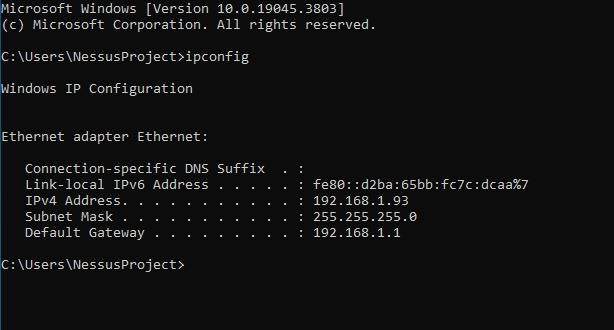
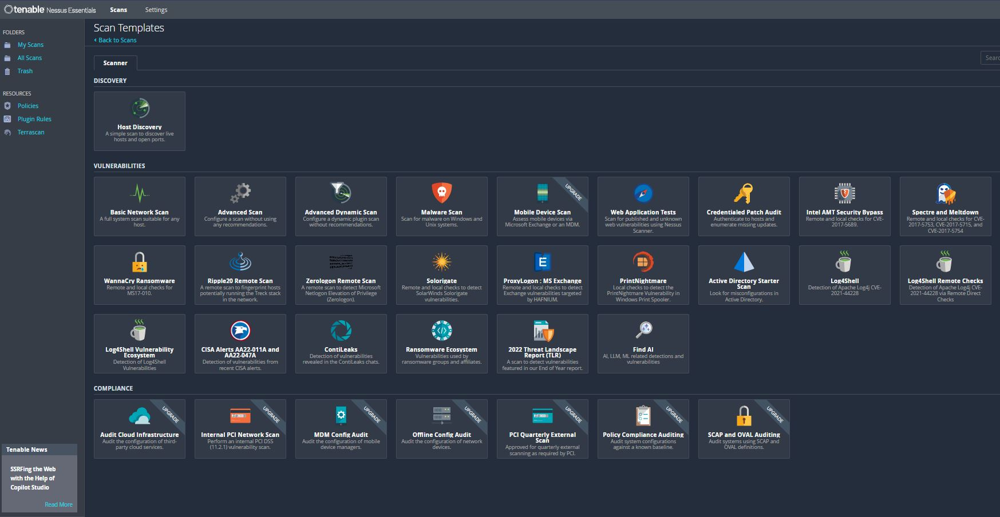
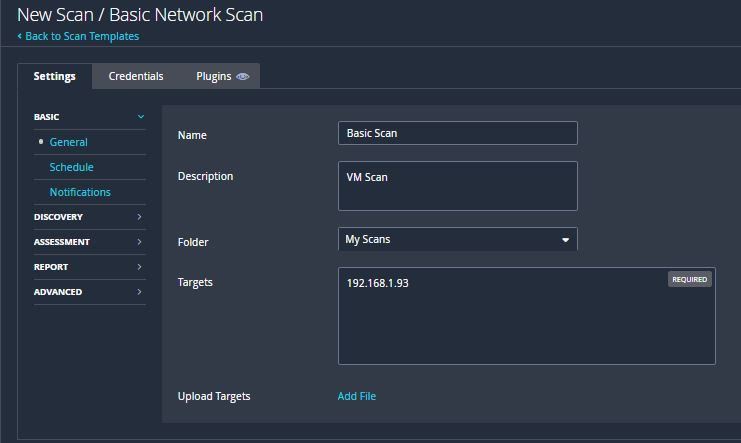
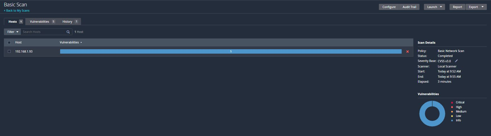
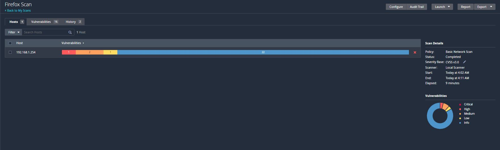
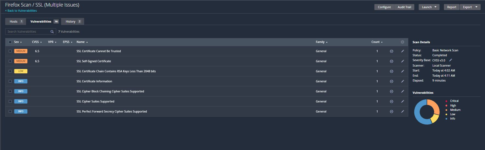
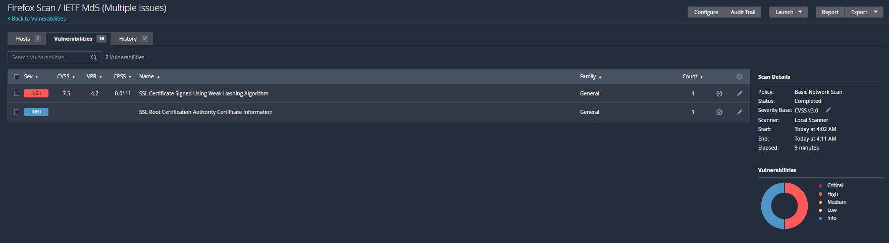

<h1></h1>
<h2>Description</h2>
I set up a home lab using Nessus to gain hands-on experience with vulnerability scanning. In this lab, I scanned a VirtualBox environment and an outdated application to identify potential security weaknesses.
 
 
<h2>Nessus</h2>
Nessus is a tool that scans networks and devices to find security weaknesses, like outdated software or misconfigurations. It helps identify vulnerabilities so you can fix them and keep your systems secure.
 
 
<h2>Utilities Used</h2>

- <b>Virtual Box</b>
<h2></h2>

- <b>Nessus Vulnerability Scanner</b>

<h2></h2>

- <b>Firefox web browser</b>

<h2></h2>

<h2>Project walk-through</h2>
I created a VirtualBox setup to scan for vulnerabilities and made sure my host computer could communicate with the VM by using PowerShell to ping its IP address. After setting up the VM, I downloaded an outdated Firefox browser. Then, I used Nessus to scan the virtual machine, which let me see different vulnerability levels. This gave me some great hands-on experience with spotting security issues.
 
 
<h2>Verified Communication</h2>
<h2></h2><h2></h2>

<h2>Scan Templates</h2>

- Selected basic scan

 Using the VM IP address as the target
 
<h2></h2>
<h2></h2>

<h2>Scan Results</h2>

<h2></h2>

The results showed 5 info vulnerabilites 

- This type of result can provide information about your system or network. It’s not a security threat, but it helps you get a better understanding and spot things that could be improved.

<h2>Firefox scan results</h2>

<h2></h2>
<h2></h2>
<h2></h2>

Because the web browser is outdated, it has quite a few vulnerabilities.
You can remediate these vulnerabilites by simply downloading the most up to date version of the browser.

<h2>Goal</h2>

My goal was to gain some hands-on experience with a vulnerability scanner to build practical skills that can be directly applied in IT roles. I did this by running two different scans to check out a variety of vulnerabilities.
